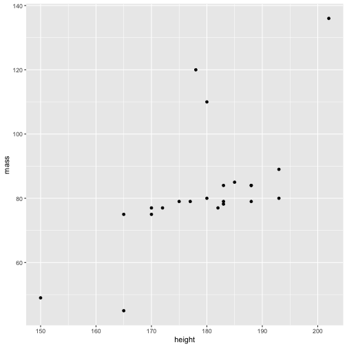

```r
library(simiao)
```


```r
library(tidyverse)
#> ── Attaching packages ──────────────────────── tidyverse 1.3.0 ──
#> ✓ ggplot2 3.2.1     ✓ purrr   0.3.3
#> ✓ tibble  2.1.3     ✓ dplyr   0.8.3
#> ✓ tidyr   1.0.0     ✓ stringr 1.4.0
#> ✓ readr   1.3.1     ✓ forcats 0.4.0
#> ── Conflicts ─────────────────────────── tidyverse_conflicts() ──
#> x dplyr::filter() masks stats::filter()
#> x dplyr::lag()    masks stats::lag()

starwars %>%
  filter(species =="Human")%>% ggplot()+aes(x=height, y=mass)+geom_point()
#> Warning: Removed 13 rows containing missing values (geom_point).
```



In Figure \@(fig::starwars-plot) we can see that ...
